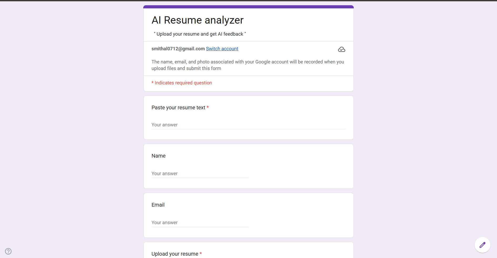
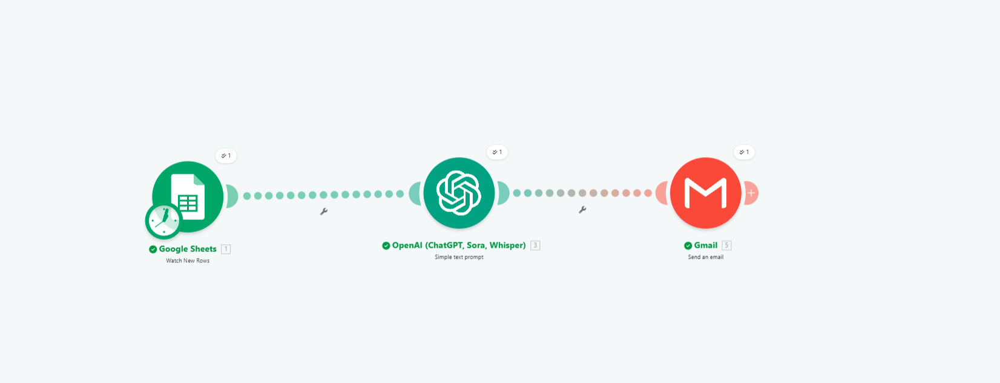
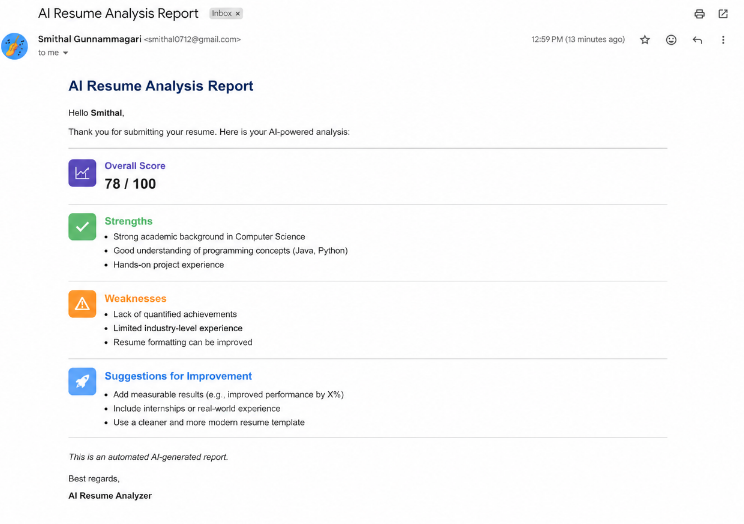
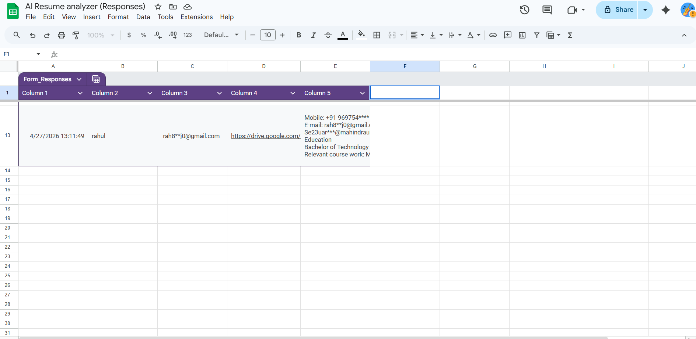

* AI Resume Analyzer Automation

* Overview
This project analyzes resumes using AI and sends feedback automatically via email.

* Tech Stack
- Google Forms
- Google Sheets
- Make
- OpenAI
- Gmail

* Workflow
1. User submits resume in Google Form  
2. Data goes to Google Sheets  
3. Make triggers automation  
4. OpenAI analyzes resume  
5. Gmail sends report  

---

* Screenshots

* Google Form

* Make Flow

* Email Output

* Google Sheets

